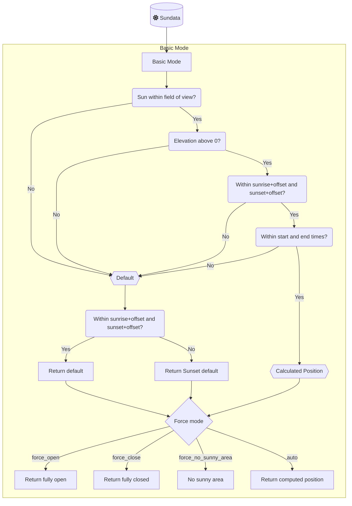
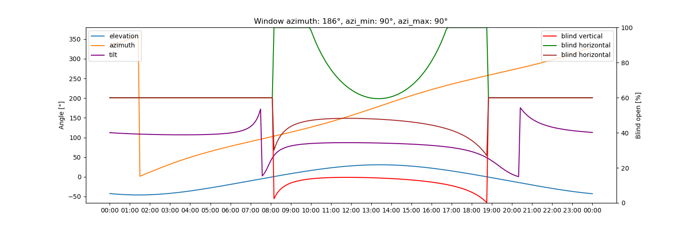

# Simple Auto Cover

Simple Auto Cover exposes sensors that calculate the optimal blind position to reduce glare based on the sun's position.

This project began as a fork of [Adaptive
Cover](https://github.com/basbruss/adaptive-cover) by [Bas
Brussee](https://github.com/basbruss). This fork is intended to be a simpler
implementation of the same idea, but with climate and other functionality pushed
out of the project and into user's custom automations. The original project is
still maintained at the time of this writing and recommended for those who want
a more complete all-in-one solution.

That integration originally built upon the template sensor from this forum post [Automatic
Blinds](https://community.home-assistant.io/t/automatic-blinds-sunscreen-control-based-on-sun-platform/)

- [Simple Auto Cover](#simple-auto-cover)
  - [Features](#features)
  - [Installation](#installation)
    - [HACS (Recommended)](#hacs-recommended)
    - [Manual](#manual)
  - [Setup](#setup)
  - [Cover Types](#cover-types)
  - [Modes](#modes)
    - [Basic mode](#basic-mode)
  - [Variables](#variables)
    - [Common](#common)
    - [Vertical](#vertical)
    - [Horizontal](#horizontal)
    - [Tilt](#tilt)
    - [Automation](#automation)
    - [Blindspot](#blindspot)
  - [Entities](#entities)
  - [Features Planned](#features-planned)
    - [Simulation](#simulation)

## Features

- Individual service devices for `vertical`, `horizontal` and `tilted` covers
- Binary sensor tracking when the sun is in front of the window
- Sensors for `start` and `end` time
- Auto manual override detection
- Simple select entity to force shades open or closed

## Installation

### HACS (Recommended)

Add <https://github.com/travisp/adaptive-cover> as custom repository to HACS.
Search and download Simple Auto Cover within HACS.

Restart Home-Assistant and add the integration.

### Manual

Download the `simple_auto_cover` folder from this github.
Add the folder to `config/custom_components/`.

Restart Home-Assistant and add the integration.

## Setup

Simple Auto Cover supports vertical, horizontal and venetian (tilted) blinds.
Each type has its own specific parameters to setup a sensor. To setup the sensor you first need to find out the azimuth of the window(s). This can be done by finding your location on [Open Street Map Compass](https://osmcompass.com/).

## Cover Types

|              | Vertical                      | Horizontal                      | Tilted                          |
| ------------ | ----------------------------- | ------------------------------- | ------------------------------- |
|              |  |  |  |
| **Movement** | Up/Down                       | In/Out                          | Tilting                         |
|              | [variables](#vertical)        | [variables](#horizontal)        | [variables](#tilt)              |

## Modes

This component provides a simple `basic` strategy for positioning shades based solely on the sun's location.

### Basic mode

This mode uses the calculated position only when the sun is in front of the window, above the horizon, the current time lies between sunrise plus offset and sunset plus offset, and it is within the configured start and end times. Otherwise the integration falls back to the default position (or the sunset default outside the daylight period).

## Variables

### Common

| Variables                     | Default | Range | Description                                                                                              |
| ----------------------------- | ------- | ----- | -------------------------------------------------------------------------------------------------------- |
| Entities                      | []      |       | Denotes entities controllable by the integration                                                         |
| Window Azimuth                | 180     | 0-359 | The compass direction of the window, discoverable via [Open Street Map Compass](https://osmcompass.com/) |
| Default Position              | 60      | 0-100 | Initial position of the cover in the absence of sunlight glare detection                                 |
| Minimal Position              | 100     | 0-99  | Minimal opening position for the cover, suitable for partially closing certain cover types               |
| Maximum Position              | 100     | 1-100 | Maximum opening position for the cover, suitable for partially opening certain cover types               |
| Field of view Left            | 90      | 1-90  | Unobstructed viewing angle from window center to the left, in degrees                                    |
| Field of view Right           | 90      | 1-90  | Unobstructed viewing angle from window center to the right, in degrees                                   |
| Minimal Elevation             | None    | 0-90  | Minimal elevation degree of the sun to be considered                                                     |
| Maximum Elevation             | None    | 1-90  | Maximum elevation degree of the sun to be considered                                                     |
| Default position after Sunset | 0       | 0-100 | Cover's default position from sunset to sunrise                                                          |
| Offset Sunset time            | 0       |       | Additional minutes before/after sunset                                                                   |
| Offset Sunrise time           | 0       |       | Additional minutes before/after sunrise                                                                  |
| Inverse State                 | False   |       | Calculates inverse state for covers fully closed at 100%                                                 |

### Vertical

| Variables         | Default | Range | Description                                                                                 |
| ----------------- | ------- | ----- | ------------------------------------------------------------------------------------------- |
| Window Height     | 2.1     | 0.1-6 | Length of fully extended cover/window                                                       |
| Workarea Distance | 0.5     | 0.1-2 | The distance to the workarea on equal height to the bottom of the cover when fully extended |

### Horizontal

| Variables                  | Default | Range | Description                                    |
| -------------------------- | ------- | ----- | ---------------------------------------------- |
| Awning Height              | 2       | 0.1-6 | Height from work area to awning mounting point |
| Awning Length (horizontal) | 2.1     | 0.3-6 | Length of the awning when fully extended       |
| Awning Angle               | 0       | 0-45  | Angle of the awning from the wall              |
| Workarea Distance          | 0.5     | 0.1-2 | Distance to the work area                      |

### Tilt

| Variables     | Default        | Range  | Description                                                |
| ------------- | -------------- | ------ | ---------------------------------------------------------- |
| Slat Depth    | 3              | 0.1-15 | Width of each slat                                         |
| Slat Distance | 2              | 0.1-15 | Vertical distance between two slats in horizontal position |
| Tilt Mode     | Bi-directional |        |                                                            |

### Automation

| Variables                                  | Default      | Range | Description                                                                                    |
| ------------------------------------------ | ------------ | ----- | ---------------------------------------------------------------------------------------------- |
| Minimum Delta Position                     | 1            | 1-90  | Minimum position change required before another change can occur                               |
| Minimum Delta Time                         | 2            |       | Minimum time gap between position change                                                       |
| Start Time                                 | `"00:00:00"` |       | Earliest time a cover can be adjusted after midnight                                           |
| Start Time Entity                          | None         |       | The earliest moment a cover may be changed after midnight. _Overrides the `start_time` value_  |
| Manual Override Duration                   | `15 min`     |       | Minimum duration for manual control status to remain active                                    |
| Manual Override reset Timer                | False        |       | Resets duration timer each time the position changes while the manual control status is active |
| Manual Override Threshold                  | None         | 1-99  | Minimal position change to be recognized as manual change                                      |
| Manual Override ignore intermediate states | False        |       | Ignore StateChangedEvents that have state `opening` or `closing`                               |
| End Time                                   | `"00:00:00"` |       | Latest time a cover can be adjusted each day                                                   |
| End Time Entity                            | None         |       | The latest moment a cover may be changed . _Overrides the `end_time` value_                    |
| Adjust at end time                         | `False`      |       | Make sure to always update the position to the default setting at the end time.                |

### Blindspot

| Variables            | Default | Range                 | Example | Description                                                                                                          |
| -------------------- | ------- | --------------------- | ------- | -------------------------------------------------------------------------------------------------------------------- |
| Blind Spot Left      | None    | 0-max(fov_right, 180) |         | Start point of the blind spot on the predefined field of view, where 0 is equal to the window azimuth - fov left.    |
| Blind Spot Right     | None    | 1-max(fov_right, 180) |         | End point of the blind spot on the predefined field of view, where 1 is equal to the window azimuth - fov left + 1 . |
| Blind Spot Elevation | None    | 0-90                  |         | Minimal elevation of the sun for the blindspot area.                                                                 |

## Entities

The integration dynamically adds multiple entities based on the used features.

These entities are always available:
| Entities | Default | Description |
| --------------------------------------------- | -------------- | ---------------------------------------------------------------------------------------------------------------------- |
| `sensor.{type}_cover_position_{name}` | | Reflects the current state determined by predefined settings and factors such as sun position, weather, and temperature |
| `sensor.{type}_control_method_{name}` | `auto` | Indicates the active control mode. Values are `auto`, `force`, and `manual`. |
| `sensor.{type}_start_sun_{name}` | | Shows the starting time when the sun enters the window's view, with an interval of every 5 minutes. |
| `sensor.{type}_end_sun_{name}` | | Indicates the ending time when the sun exits the window's view, with an interval of every 5 minutes. |
| `binary_sensor.{type}_manual_override_{name}` | `off` | Indicates if manual override is engaged for any blinds. |
| `binary_sensor.{type}_sun_infront_{name}` | `off` | Indicates whether the sun is in front of the window within the designated field of view. |
| `switch.{type}_toggle_control_{name}` | `on` | Activates the adaptive control feature. When enabled, blinds adjust based on calculated position, unless manually overridden. |
| `switch.{type}_manual_override_{name}` | `on` | Allows detection of manual overrides. A cover is marked if its position differs from the calculated one, resetting to adaptive control after a set duration. |
| `button.{type}_reset_manual_override_{name}` | `on` | Resets manual override tags for all covers; if `switch.{type}_toggle_control_{name}` is on, it also restores blinds to their correct positions. |
| `select.{type}_force_mode_{name}` | `auto` | Forces the covers to be fully open or closed regardless of normal calculations. Options are `auto`, `force_open`, `force_close`, and `force_no_sunny_area`. |

## Features Planned

- Manual override controls
  - ~~Time to revert back to adaptive control~~
  - ~~Reset button~~
  - Wait until next manual/none adaptive change

- ~~Algorithm to control radiation and/or illumination~~

### Simulation

